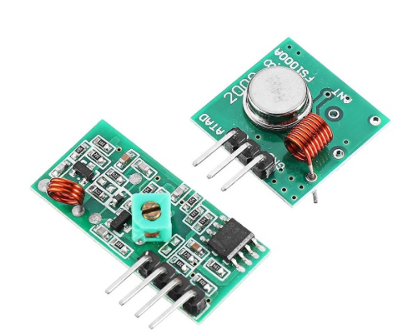
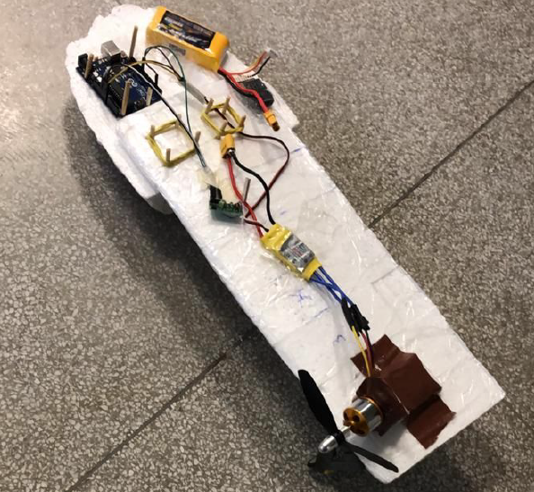
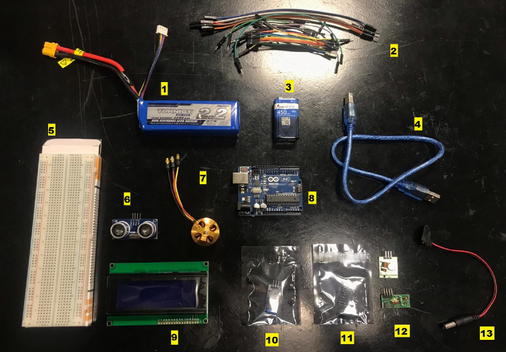

# The Maple Seed Drone Prototype
This repository shares the code developed to fly a simple Maple Seed Drone,  which was developed in the UFABC course "Engenharia Unificada" or "Unified Enginnering", taught in  the second trimester of 2019.

The prototype uses two Arduino microcontrollers, the first used as Maple Seed Drone on-board controller, and the second as RC controller.

The main goal of the project was getting the drone lift off the ground. The communication between the boards was achieved using a 433 MHz RF module, as shown below.

## The prototype

## Materials

## Code Explanation

Most of the code deals only with communication between the Receiver and Transmitter. The Transmitter board reads and process the data from a potentiometer (control stick) and sends it to Receiver board. The Receiver gets the message from the Transmitter and writes the data as PWM input to the motor. So and the flow restarts. 

## Flying results

## Future Work

- Review the motor configuration;
- Integrate with IMU sensors (gyro / mag / accel), as well as a sonar for altitude ranging;
- Add a controllable flap to the wings;
- Design a controller for drone stabilization and maneuverability;
