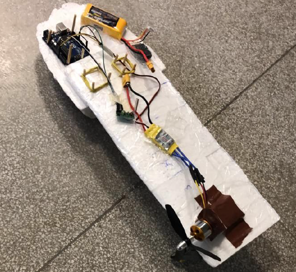
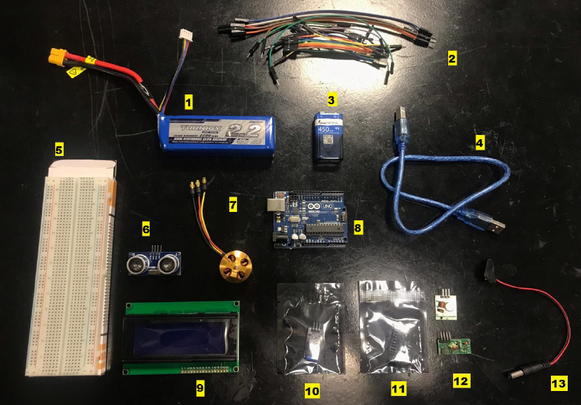

# The Maple Seed Drone Protoype
This repository shares the code developed to fly a simple Maple Seed Drone,  which was developed in the UFABC course "Engenharia Unificada" or "Unified Enginnering", taught in  the second trimester of 2019.

The prototype uses two Arduino microcontrollers, the first used as Maple Seed Drone on-board controller, and the second as RC controller.

The main goal of the project was getting the drone lift off the ground. The communication between the boards was achieved using a 400MHz RF module, as shown below.

## The prototype

## Materials

## Code Explanation

## Flying results

## Future Work

